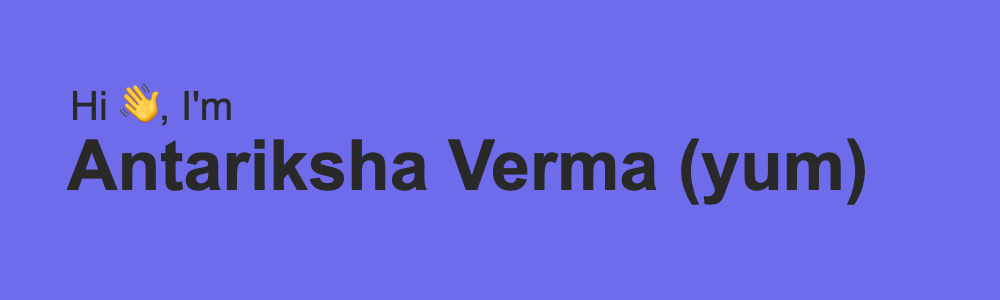

## 📕 Blog posts
<!-- BLOG-POST-LIST:START -->
- [How to make console.log() colourful](https://thewebtech.hashnode.dev/how-to-make-consolelog-colourful)
- [My DEV X DO Hackathon Idea (Dont Copy)](https://dev.to/yum/my-dev-x-do-hackathon-idea-dont-copy-5701)
- [DEV Badge](https://dev.to/yum/dev-badge-hf4)
- [Create a Simple Ice Cream Illustration in CSS](https://thewebtech.hashnode.dev/create-a-simple-ice-cream-illustration-in-css)
- [Download YouTube Videos with Python - Part 1](https://thewebtech.hashnode.dev/download-youtube-videos-with-python-part-1)
<!-- BLOG-POST-LIST:END -->

<!-- GitHub stats -->
## ⚡ My Dev Stats

<!-- GitHub Stats -->

<!-- Most Used Languages -->

<!-- Stackoverflow stats -->
## StackOverflow Stats
 

<!-- Technologies -->
## Technologies

<!-- Languages -->
### Languages

<!-- Database -->
### Databases

<!-- Frameworks -->
### Frameworks

<!-- CI/CD -->
### CI/CD

<!-- Social -->
## Connect with me

 
 
 
 
 

 
 

